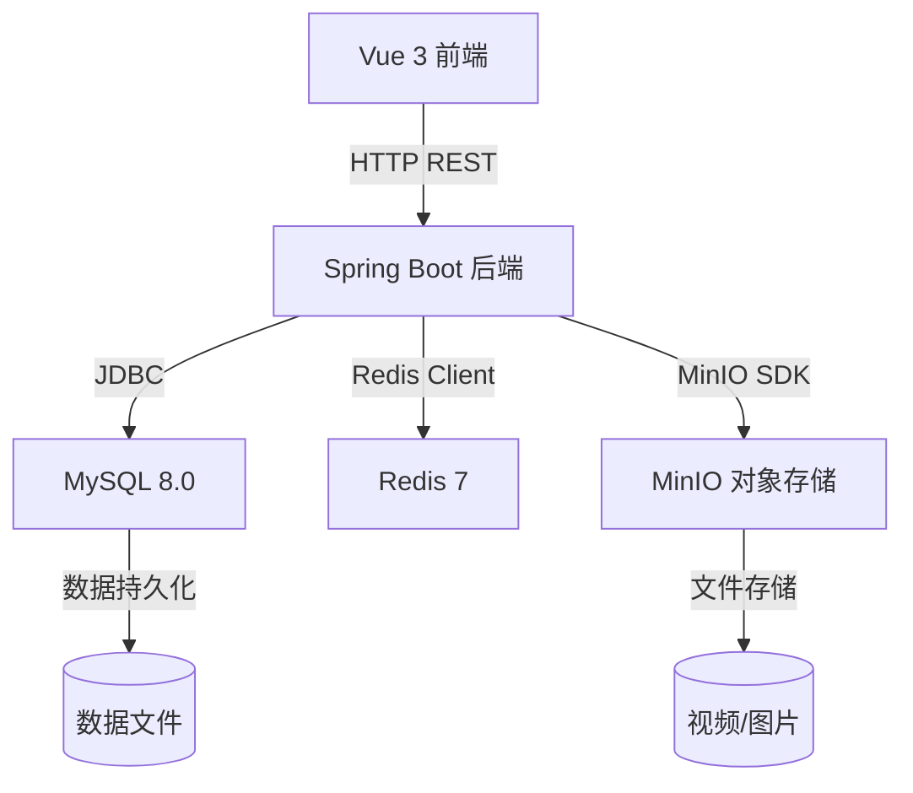

# 🎵 Douyin Web Demo

仿抖音短视频网页版，复现抖音核心浏览与互动体验。前后端分离架构，支持视频上传、信息流浏览、点赞评论、收藏搜索、热门排行。

## 功能列表

| 模块 | 功能 | 状态 |
|------|------|------|
| 用户 | 注册 / 登录 / JWT 鉴权 / 个人主页 | ✅ 已完成 |
| 视频 | 上传 / 信息流 / 详情 / 作品列表 | ✅ 已完成 |
| 互动 | 点赞 / 取消点赞 / 二级回复评论 | ✅ 已完成 |
| 收藏 | 收藏视频 / 收藏列表 | ✅ 已完成 |
| 搜索 | 关键词搜索视频 | ✅ 已完成 |
| 排行 | Redis ZSet 热门视频排行榜 | ✅ 已完成 |
| Docker 部署 | docker compose 一键编排 | ✅ 已完成 |

### 暂不实现
直播、私信、推荐算法、商城

## 技术栈

| 层 | 技术 |
|------|------|
| 后端框架 | Spring Boot 3.x |
| ORM | MyBatis Plus 3.5+ |
| 数据库 | MySQL 8.0 |
| 缓存 | Redis 7.x |
| 对象存储 | MinIO |
| 认证 | JWT (jjwt 0.12+) |
| 前端框架 | Vue 3 (Composition API) |
| 构建工具 | Vite |
| 状态管理 | Pinia |
| HTTP 客户端 | Axios |
| UI 组件库 | Element Plus |

## 项目架构



## 项目结构

```
douyin-demo/
├── backend/                          # Spring Boot 后端
│   ├── pom.xml
│   └── src/main/java/com/douyin/
│       ├── DouyinApplication.java    # 启动类
│       ├── config/                   # 配置（Security, MyBatisPlus, Redis, MinIO, CORS）
│       ├── controller/               # 控制器
│       ├── service/                  # 业务接口
│       │   └── impl/                 # 业务实现
│       ├── mapper/                   # MyBatis Mapper
│       ├── entity/                   # 数据库实体
│       ├── dto/                      # 请求对象
│       ├── vo/                       # 视图对象
│       ├── common/                   # 公共类（Result, 异常处理）
│       └── util/                     # 工具类（JWT, MinIO, Redis）
│
├── frontend/                         # Vue 3 前端
│   └── src/
│       ├── api/                      # API 封装
│       ├── stores/                   # Pinia 状态
│       ├── views/                    # 页面组件
│       ├── components/               # 公共组件
│       ├── router/                   # 路由配置
│       └── utils/                    # 工具函数
│
├── docs/
│   ├── api.md                        # API 接口文档
│   ├── database.sql                  # 数据库建表脚本
│   └── architecture.md               # 架构设计文档
│
├── CLAUDE.md                         # AI 编码规范
└── README.md
```

## 快速开始

### 环境要求

| 工具 | 最低版本 | 说明 |
|------|----------|------|
| JDK | 17 | 后端运行环境 |
| Maven | 3.8+ | 后端构建 |
| Node.js | 18 | 前端运行环境 |
| MySQL | 8.0 | 数据库 |
| Redis | 7.x | 缓存 |
| MinIO | 最新稳定版 | 对象存储 |

### 本地开发

**1. 启动中间件**

```bash
# MySQL — Windows 服务自启或手动启动
net start MySQL80

# Redis
redis-server

# MinIO
minio.exe server D:/APP/Minio/data --console-address :9001
```

**2. 初始化数据库**

```bash
mysql -u root -p < docs/database.sql
```

**3. 修改配置**

编辑 `backend/src/main/resources/application.yml`，按本地环境调整数据库密码、Redis 密码、MinIO 地址等。

**4. 启动后端**

```bash
cd backend
mvn spring-boot:run
# 启动后访问 http://localhost:8080
```

**5. 启动前端**

```bash
cd frontend
npm install
npm run dev
# 启动后访问 http://localhost:3000
```

### Docker 部署

```bash
docker compose up -d
# 一键启动 MySQL + Redis + MinIO + Backend + Frontend
```

**5 个容器**：
| 容器 | 端口 | 说明 |
|------|------|------|
| douyin-mysql | 3307 | MySQL 8.0，自动建库建表（避免和本机 MySQL 冲突） |
| douyin-redis | 6379 | Redis 7 |
| douyin-minio | 9000/9001 | 对象存储（API / 控制台） |
| douyin-backend | 8080 | Spring Boot 后端（含 FFmpeg） |
| douyin-frontend | 80 | Vue3 前端 + Nginx |

**常用命令**：
```bash
docker compose up -d          # 启动
docker compose down           # 停止
docker compose up -d --build  # 重建并启动
docker compose logs -f backend # 查看后端日志
```

**环境变量**（backend 服务，非必改 — 通过 docker-compose.yml 预设）：
| 变量 | 默认值 |
|------|------|
| `SPRING_DATASOURCE_URL` | `jdbc:mysql://mysql:3306/douyin?...` |
| `SPRING_DATA_REDIS_HOST` | `redis` |
| `MINIO_ENDPOINT` | `http://minio:9000` |
| `DOUYIN_FFMPEG_PATH` | `/usr/bin/ffmpeg` |
| `JWT_SECRET` | 见 compose 文件 |

## 配置说明

后端配置文件 `backend/src/main/resources/application.yml`：

| 配置项 | 说明 | 默认值 |
|------|------|------|
| `server.port` | 后端端口 | 8080 |
| `spring.datasource.url` | MySQL 连接 | `jdbc:mysql://localhost:3306/douyin` |
| `spring.data.redis.host` | Redis 地址 | localhost |
| `minio.endpoint` | MinIO API 地址 | `http://localhost:9000` |
| `minio.access-key` | MinIO 访问密钥 | minioadmin |
| `minio.secret-key` | MinIO 密钥 | minioadmin |
| `minio.bucket` | 存储桶名称 | douyin |
| `jwt.secret` | JWT 签名密钥 | — |
| `jwt.expiration` | Token 过期时间(ms) | 604800000 (7天) |
| `douyin.ffmpeg.path` | FFmpeg 路径 | D:/APP/ffmpeg/bin/ffmpeg.exe |

## API 文档

详见 [docs/api.md](docs/api.md)

所有接口统一返回格式：
```json
{
  "code": 200,
  "message": "操作成功",
  "data": {}
}
```

认证方式：`Authorization: Bearer <token>`

## 文档

- [API 接口文档](docs/api.md)
- [数据库初始化脚本](docs/database.sql)
- [架构设计文档](docs/architecture.md)
- [AI 编码规范](CLAUDE.md)

## License

MIT
